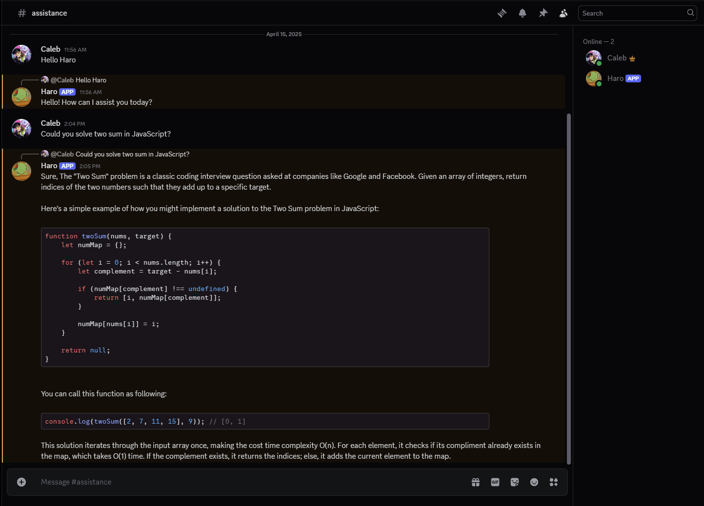

# 🤖 Discord AI Assistant Bot

This is a Discord bot powered by OpenAI and `discord.js`. It can chat like an AI assistant and respond to slash commands.

---

## 📹 Preview



---

## 🚀 Features

- GPT-4 powered responses in specific channels
- Math commands (`/add`, `/subtract`)
- Music (Coming soon!)

---

## 📦 Requirements

- Node.js v16.9.0 or higher
- A Discord bot token
- An OpenAI API key
- A Discord Application with slash commands set up

---

## 📁 Setup

1. **Clone the repository**
   
   Click on the "Code" button to the right of the "Add file" button. Then you will pull it down to your local machine.

2. **Install dependencies**
   ```bash
   npm install
   ```

3. **Create a `.env` file**
   In the root directory, add your secrets:
   ```env
   Token=your-discord-bot-token
   OPENAI_KEY=your-openai-api-key
   CLIENT_ID=your-discord-application-client-id
   GUILD_ID=your-test-guild-id
   ```

4. **Register Slash Commands**
   ```bash
   node slashCommands.js
   ```

5. **Run the bot**
   ```bash
   node app.js
   ```

---

## ⚙️ Notes

- The bot only responds in specific channels (configured in `CHANNELS` inside `app.js`) or when mentioned.
- Be sure your bot is added to your server with proper permissions (read messages, send messages, use slash commands).

---

## 🧠 Powered by

- [Discord.js](https://discord.js.org/)
- [OpenAI API](https://platform.openai.com/)